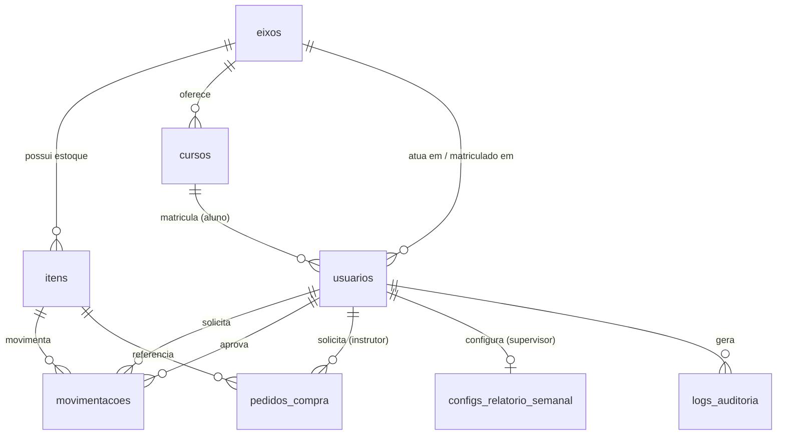

# Documento de Requisitos — Sistema de Gerenciamento de Almoxarifado (SENAI)

---

## 1. Visão Geral do Projeto

**Nome do projeto:**
Inventfy

**Resumo:**
Auxilia alunos, docentes e equipe técnico-pedagógica a controlar gerenciamento de componentes, peças e ferramentas. Pensado para SENAI nas oficinas do eixo de metalmecânica e eletroeletrônica. Gerencia entrada, saída e pedidos de empréstimo.

**Problema atual:**
Atualmente é gerenciado na metalmecânica através de planilha de papel registrando empréstimos. Na eletroeletrônica não há controle. O principal problema é saber o que há no almoxarifado, assim como quantidade, quem usou e se foi devolvido

---

## 2. Objetivos

**O que o sistema precisa resolver? Listado em ordem de prioridade.**

1. Controlar entrada/saída e quantidade de peças, componentes e ferramentas.
2. Indicar usuário atual. Histórico de usos.
3. Solicitar e aprovar empréstimos para discentes e outros ambientes.
4. Garantir que todos usem e se torne padrão.
5. Fazer/auxiliar pedido de compra.

**Fora de escopo (o que o sistema NÃO vai fazer, pelo menos nesta versão):**
1. Integrar com sensores e atuadores de forma a se tornar um sistema de automação.
2. [Feature futura] Exibir e organizar informações adicionais como:
- Valor de compra;
- Práticas que utilizam o material;
- Similares;
- Folha de dados, manual, explodido e guia de reparo.
3. [Feature futura] Cadastro e login automático. Realizado através de sincrona com dados importados do login corporativo de e-mail institucional FIEMG da Microsoft para docente e supervisor ou e-mail institucional Google para discente.

---

## 3. Contexto e Usuários

**Eixos/oficinas atendidas:**
- Eletroeletrônica
- Metalmecânica

**Expansão futura:**
Projeto será expandido futuramente para os eixos de Vestuário e Tecnologia da Informação.

**Perfis de usuário (papéis no sistema):**

| Perfil | Quem é | O que pode fazer |
| --- | --- | --- |
| Aluno | Usuário discente | Solicita retirada de itens |
| Instrutor | Usuário docente | Retira itens, adiciona itens, verifica somente usuário atual, aprova retirada de itens, faz pedido de compra |
| Supervisor | Coordenação | Acesso total, gerencia usuários, retira itens, adiciona itens, verifica histórico de uso, aprova retirada de itens, faz pedido de compra e gera relatórios |

Os termos "instrutor" e "docente" são usados de forma intercambiável neste documento.

**Quantidade estimada de usuários simultâneos:**
Para projeto piloto:
- Alunos: 600
- Instrutor: 20
- Supervisor: 5

**Dispositivos de acesso:**
- Smartphone
- Tablet
- Desktop

---

## 4. Requisitos Funcionais

### 4.1 Cadastro de itens/materiais (RF01)
- Campos que cada item precisa ter: nome, código (Proteus), número de patrimônio (se aplicável), categoria, medida ou modelo, descrição, quantidade atual, quantidade mínima, localização física e foto.
- Campo condição atual (novo, em manutenção, danificado, etc.) aplicável somente a ferramentas/equipamentos e componentes reutilizáveis. Insumos, por serem consumíveis, não possuem condição.
- Diferenciação entre insumo, componente reutilizável e ferramenta/equipamento.

### 4.2 Movimentação de estoque (RF02)
- Material entra após devolução ou chegada de compra realizada pelo Setor de Compra (sistema independente).
- Saída realizada após empréstimo para outro ambiente ou discente (prática diária) ou consumo.
- Aprovação da retirada é feita pelo docente ou supervisor.
- Docente pode fazer retirada sem permissão, restrito a itens do próprio eixo (ver Regra de Negócio 6).
- Toda movimentação deve conter registro, seja ela entrada ou saída. Quem solicitou, quem aprovou (se necessário), horário, quantidade e finalidade.
- Possíveis estados de um item:
    Exibição para discente: pendente, aprovada, negada e disponível.
    Exibição para docente e supervisor: pendente, aprovada, negada, disponível e atrasada.
- Ao retirar um item marcado com condição "danificado", o sistema exibe aviso de que o item está com defeito e pergunta se ele será reparado. Se sim, a condição do item é alterada para "em manutenção".
- Sempre que um item é marcado como "danificado", o docente responsável pelo eixo recebe alerta instantâneo (aplicativo e e-mail). Supervisor não recebe alerta imediato; o item aparece no relatório semanal (ver RF05 e RF06).
- Qualquer usuário pode marcar um item "em manutenção" ou "danificado" como reparado, retornando sua condição para "novo".

### 4.3 Controle de estoque mínimo / alertas (RF03)
- Todas as notificações são feitas por PWA e e-mail.
- O sistema deve avisar quando um item está acabando. O limiar é definido no momento do cadastro e pode ser alterado somente pelo supervisor.
- Docentes recebem alerta instantâneo pelo aplicativo e e-mail. Supervisor não recebe alerta imediato; itens que atingiram o limiar mínimo aparecem no relatório semanal (ver RF05 e RF06).

### 4.4 Busca e consulta (RF04)
- Filtros de quantidade, turma, eixo, categoria, localização, descrição, disponibilidade e condição (para ferramentas/equipamentos e componentes reutilizáveis).

### 4.5 Relatórios (RF05)
Acesso: relatórios são exclusivos do supervisor. Instrutor não possui acesso a relatórios.

- Histórico de movimentação
- Itens mais usados
- Itens menos usados
- Inventário por oficina
- Movimentação por usuário
- Opção de exportar para PDF ou Excel

**Relatório semanal (supervisão):**
Substitui notificações imediatas de atraso de devolução para discente e docente (ver Regra de Negócio 3). Enviado automaticamente por e-mail no dia e horário configurados pelo supervisor (ver RF06). Conteúdo configurável por interruptores on/off:
- Movimentações
- Cursos que usaram a oficina
- Instrutores que usaram a oficina
- Ferramentas que necessitam reparo
- Itens que atingiram o limiar mínimo
- Alunos e docentes inadimplentes (com devolução em atraso)
- etc.

### 4.6 Gestão de usuários e permissões (RF06)
Cadastro efetuado pelo supervisor:
- Nome
- Matrícula
- E-mail
- Foto (opcional)
- Eixo
- Curso (exclusivo para aluno)
- Senha inicial gerada aleatoriamente
- Tipo de usuário

Aplicativo valida o e-mail:
- Para funcionário deve fazer parte do domínio @fiemg.com.br (Microsoft)
- Para aluno deve fazer parte do domínio @senaimgaluno.com.br (Google)

O usuário recém-criado recebe por e-mail senha inicial gerada aleatoriamente e sugere alteração (feita no aplicativo).

**Edição de perfil:**
Todo usuário tem acesso a uma tela para alterar dados que não sejam pertinentes ao funcionamento da aplicação (ex.: foto).
Supervisor possui uma alteração adicional nessa tela, referente à configuração do relatório semanal (ver RF05):
- Dia da semana e horário de geração/envio (padrão: sexta-feira, 14h).
- Interruptores (on/off) para cada item incluído no relatório: movimentações, cursos que usaram a oficina, instrutores que usaram a oficina, ferramentas que necessitam reparo, itens que atingiram o limiar mínimo, alunos e docentes inadimplentes, etc.

### 4.7 Pedido de compra (RF07)
Opção disponível para instrutor.
Cria uma lista onde é possível adicionar item, quantidade e justificativa de aquisição.
Permite a edição das características do item (somente nesta tela).
Soliticação cria pedido que é enviado para e-mail dos supervisores. Notificação gerada para que consultem a caixa de entrada.

---

## 5. Requisitos Não Funcionais

**Responsividade:**
Interface única responsiva (mobile/tablet/desktop) via React.

**Desempenho:**
Tempo de resposta esperado
- Cadastro de usuários: <5s
- Envio de notificações e e-mails: <30s
- Consulta de itens: <1500ms
- Movimentação: <3s
Volume de itens cadastrados: <3000
Volume de movimentações por dia: <500
- Estimado: 30–50 conectados ao mesmo tempo em horário de aula

**Segurança:**
- Autenticação por login e senha.
- Senhas devem ser armazenadas com hash e atender aos requisitos:
    - No mínimo 8 caracteres e no máximo 16 caracteres;
    - No mínimo uma letra maiúscula e uma minúscula;
    - No mínimo um caractere especial ou número.
- Níveis de permissão por perfil.
- Log de auditoria: quem alterou o quê e quando e de onde (endereço IP).
- HTTPS obrigatório.
- Proteção contra ataques comuns: SQL injection, XSS e CSRF.

**Disponibilidade:**
Aulas geralmente de segunda a sábado, das 7h às 22h30.
Disponibilidade obrigatória: horário de expediente + aulas noturnas.
Fora desse horário, manutenção e backup são aceitáveis.
Meta: 99% de uptime durante horário de aula (permite ~1h/mês de indisponibilidade).

**Hospedagem/Infraestrutura:**
Hospedagem definida em conjunto com o TI do SENAI.
Para desenvolvimento e homologação, servidor Ubuntu 24.04 LTS local.
Para produção, VPS.

**Backup e recuperação de dados:**
Frequência: backup diário do banco (automatizado, por script cron).
Retenção: guardar últimos 30 dias diários + últimos 6 meses semanais.
Local: backup em local diferente do servidor principal (nuvem).
Teste de restauração: pelo menos 1x por semestre, testar se o backup realmente restaura.

---

## 6. Regras de Negócio

1. Ferramenta ou componente reutilizável emprestado para discente tem prazo de devolução definido de acordo com turno:
- Manhã: 11h30
- Tarde: 17h30
- Noite: 22h30
Validação do turno feita de acordo com momento da retirada.
2. Ferramenta ou componente reutilizável emprestado para docente tem prazo de devolução definido de um dia.
Insumos são consumíveis e não retornam ao estoque, portanto não possuem prazo de devolução.
3. Caso o prazo de devolução seja excedido e não houve registro de entrada é enviado notificação e e-mail:
Emprestada para discente: enviado para instrutor. Supervisor não recebe notificação imediata, o atraso é incluído no relatório semanal (ver RF05 e RF06).
Emprestada para docente: enviado para o próprio docente (notificação diferente lembrando de devolver). Supervisor não recebe notificação imediata, o atraso é incluído no relatório semanal (ver RF05 e RF06).
Emprestada para supervisor: enviado notificação diferente lembrando de devolver.
4. Pedido de compra não é gerado automaticamente caso item atinja limiar mínimo.
5. Cada oficina tem estoque próprio. Alunos só podem ver estoque do eixo em que estão inseridos. Docentes e supervisores podem acessar qualquer estoque.
6. Docentes visualizam itens de todos os eixos, mas só podem retirar sem aprovação itens do eixo em que atuam. Retirada de itens de outro eixo requer aprovação do supervisor daquele eixo.

---

## 7. Modelo de Dados (rascunho)

**Convenções de nomenclatura:** tabelas em snake_case, plural (ex.: `usuarios`, `itens`); colunas em snake_case, singular. Chave primária `id` (bigserial). Toda tabela possui `created_at`; tabelas com dados editáveis também possuem `updated_at`. `logs_auditoria` é somente-inserção (append-only), por isso não possui `updated_at`.

### eixos
| Campo | Tipo | Observação |
| --- | --- | --- |
| id | PK (bigserial) | |
| nome | string | único; Eletroeletrônica, Metalmecânica, Vestuário* e Tecnologia da Informação* (*futuro) |
| created_at | datetime | |
| updated_at | datetime | |

### cursos
| Campo | Tipo | Observação |
| --- | --- | --- |
| id | PK (bigserial) | |
| nome | string | |
| eixo_id | FK → eixos.id | indexado |
| created_at | datetime | |
| updated_at | datetime | |

### usuarios
| Campo | Tipo | Observação |
| --- | --- | --- |
| id | PK (bigserial) | |
| nome | string | |
| matricula | string | único |
| email | string | único; domínio validado conforme RF06 |
| senha_hash | string | ver requisitos de senha (Seção 5) |
| foto | string (opcional) | editável pelo próprio usuário (RF06) |
| tipo | enum | aluno \| instrutor \| supervisor |
| eixo_id | FK → eixos.id | indexado; eixo de atuação/matrícula; para supervisor, define o eixo sob sua aprovação (RN6) |
| curso_id | FK → cursos.id (nullable) | indexado; exclusivo para aluno |
| created_at | datetime | |
| updated_at | datetime | |

### itens
| Campo | Tipo | Observação |
| --- | --- | --- |
| id | PK (bigserial) | |
| nome | string | |
| codigo_proteus | string | |
| numero_patrimonio | string (nullable) | se aplicável |
| categoria | string | |
| medida_modelo | string | |
| descricao | string | |
| quantidade_atual | int | |
| quantidade_minima | int | limiar, editável somente por supervisor |
| localizacao_fisica | string | |
| foto | string | |
| tipo | enum | insumo \| componente_reutilizavel \| ferramenta_equipamento |
| condicao | enum (nullable) | novo \| em_manutencao \| danificado — aplicável somente a ferramenta_equipamento e componente_reutilizavel (RF01) |
| eixo_id | FK → eixos.id | indexado; cada oficina tem estoque próprio (RN5) |
| created_at | datetime | |
| updated_at | datetime | |

### movimentacoes
| Campo | Tipo | Observação |
| --- | --- | --- |
| id | PK (bigserial) | |
| item_id | FK → itens.id | indexado |
| tipo | enum | entrada \| saida |
| quantidade | int | |
| usuario_solicitante_id | FK → usuarios.id | indexado |
| usuario_aprovador_id | FK → usuarios.id (nullable) | indexado; nulo quando não requer aprovação (RN6) |
| finalidade | string | |
| estado | enum | pendente \| aprovada \| negada \| disponivel \| atrasada (RF02) |
| prazo_devolucao | datetime (nullable) | calculado conforme turno/perfil (RN1, RN2) |
| data_devolucao_efetiva | datetime (nullable) | |
| created_at | datetime | momento da solicitação |
| updated_at | datetime | última mudança de estado |

### pedidos_compra
| Campo | Tipo | Observação |
| --- | --- | --- |
| id | PK (bigserial) | |
| item_id | FK → itens.id (nullable) | indexado; nulo se item ainda não cadastrado |
| quantidade | int | |
| justificativa | string | |
| usuario_solicitante_id | FK → usuarios.id | indexado; somente instrutor (RF07) |
| created_at | datetime | momento da solicitação |
| updated_at | datetime | |

### configs_relatorio_semanal
| Campo | Tipo | Observação |
| --- | --- | --- |
| id | PK (bigserial) | |
| usuario_id | FK → usuarios.id | único, indexado; somente supervisor |
| dia_semana | enum | padrão: sexta-feira |
| horario | time | padrão: 14h |
| incluir_movimentacoes | bool | |
| incluir_cursos_oficina | bool | |
| incluir_instrutores_oficina | bool | |
| incluir_ferramentas_reparo | bool | |
| incluir_itens_limiar_minimo | bool | |
| incluir_inadimplentes | bool | |
| created_at | datetime | |
| updated_at | datetime | |

### logs_auditoria
| Campo | Tipo | Observação |
| --- | --- | --- |
| id | PK (bigserial) | |
| usuario_id | FK → usuarios.id | indexado |
| acao | string | |
| entidade_afetada | string | |
| endereco_ip | string | |
| created_at | datetime | momento do evento (tabela append-only, sem updated_at) |

---

## 8. Integrações

Projeto piloto não fará integrações.
Versões futuras podem incluir integração com:
- Proteus
- Login corporativo

---

## 9. Restrições Técnicas

- Backend: Node.js
- Frontend: React
- Banco de dados: PostgreSQL

---

## 10. Critérios de Aceite (MVP)

Primeira versão utilizável

- Interface responsiva
- Cadastro de usuários
- Cadastro de itens
- Consulta de itens
- Retirada e devolução de itens sem validação das regras de negócio, apenas usuário atual e último a devolver.

---

## 11. Cronograma

**Metodologia:** desenvolvimento iterativo em sprints de 2 semanas (Scrum), com entregas incrementais. Testes unitários a cada sprint; teste de integração ao final de cada fase.

| Fase | Sprint(s) | Duração estimada | Entregáveis principais |
| --- | --- | --- | --- |
| 0. Preparação | Sprint 0 | 1 semana | Setup do repositório e CI/CD; ambiente de desenvolvimento (Ubuntu 24.04 LTS local); schema inicial do banco (Seção 7); scaffolding do backend (Node.js) e frontend (React); autenticação com hash de senha e HTTPS. |
| 1. MVP | Sprints 1–3 | 6 semanas | RF06 — cadastro de usuários; RF01 — cadastro de itens; RF04 — consulta de itens; RF02 simplificado — retirada e devolução sem validação das regras de negócio (apenas usuário atual e último a devolver), conforme Critérios de Aceite (Seção 10). Interface responsiva (mobile/tablet/desktop). |
| **Marco: Teste do MVP** | Sprint 4 | 1 semana | Teste de aceitação com piloto reduzido (uma turma/oficina); validação de responsividade nos três dispositivos; coleta de feedback e correções antes de avançar para a Fase 2. |
| 2. Regras de negócio | Sprints 5–7 | 6 semanas | RN1/RN2 — prazos de devolução por turno/perfil; RF02 completo — estados de movimentação, aprovação por docente/supervisor (RN6), fluxo de item danificado/reparo; RF03 — alertas de estoque mínimo; RN3 — notificações de atraso; RF07 — pedido de compra. |
| 3. Relatórios e configuração | Sprint 8 | 2 semanas | RF05 — relatórios (histórico, itens mais/menos usados, inventário, movimentação por usuário, exportação PDF/Excel) e relatório semanal; RF06 — edição de perfil e configuração do relatório semanal pelo supervisor. |
| 4. Não funcionais e hardening | Sprint 9 | 2 semanas | Log de auditoria; backup diário automatizado e teste de restauração; proteção contra SQL injection, XSS e CSRF; teste de carga (30–50 usuários simultâneos). |
| 5. Homologação e lançamento piloto | Sprint 10 | 2 semanas | Deploy em ambiente de homologação; teste de aceite final (UAT) com docentes e supervisores; treinamento de usuários; deploy em produção (VPS, definido com o TI do SENAI); acompanhamento pós-lançamento (hipercare). |

**Duração total estimada:** ~20 semanas (~5 meses), do Sprint 0 ao lançamento piloto.
