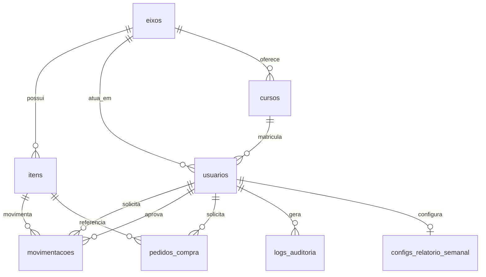

# Esquema de Banco de Dados — Inventfy

Detalha o [Modelo de Dados](../REQUIREMENTS.md#7-modelo-de-dados-rascunho) descrito no documento de requisitos. Este arquivo é o ponto de referência técnico para colunas, tipos, chaves e índices; deve ser atualizado conforme migrations/schema real do banco forem criadas no código.

**Convenções de nomenclatura:** tabelas em snake_case, plural (ex.: `usuarios`, `itens`); colunas em snake_case, singular. Chave primária `id` (bigserial). Toda tabela possui `created_at`; tabelas com dados editáveis também possuem `updated_at`. `logs_auditoria` é somente-inserção (append-only), por isso não possui `updated_at`.

### eixos
| Campo | Tipo | Observação |
| --- | --- | --- |
| id | PK (bigserial) | |
| nome | string | único; Eletroeletrônica, Metalmecânica, Vestuário* e Tecnologia da Informação* (*futuro) |
| created_at | datetime | |
| updated_at | datetime | |

### cursos
| Campo | Tipo | Observação |
| --- | --- | --- |
| id | PK (bigserial) | |
| nome | string | |
| eixo_id | FK → eixos.id | indexado |
| created_at | datetime | |
| updated_at | datetime | |

### usuarios
| Campo | Tipo | Observação |
| --- | --- | --- |
| id | PK (bigserial) | |
| nome | string | |
| matricula | string | único |
| email | string | único; domínio validado conforme RF06 |
| senha_hash | string | ver requisitos de senha (Seção 5) |
| foto | string (opcional) | editável pelo próprio usuário (RF06) |
| tipo | enum | aluno \| instrutor \| supervisor |
| eixo_id | FK → eixos.id | indexado; eixo de atuação/matrícula; para supervisor, define o eixo sob sua aprovação (RN6) |
| curso_id | FK → cursos.id (nullable) | indexado; exclusivo para aluno |
| created_at | datetime | |
| updated_at | datetime | |

### itens
| Campo | Tipo | Observação |
| --- | --- | --- |
| id | PK (bigserial) | |
| nome | string | |
| codigo_proteus | string | |
| numero_patrimonio | string (nullable) | se aplicável |
| categoria | string | |
| medida_modelo | string | |
| descricao | string | |
| quantidade_atual | int | |
| quantidade_minima | int | limiar, editável somente por supervisor |
| localizacao_fisica | string | |
| foto | string | |
| tipo | enum | insumo \| componente_reutilizavel \| ferramenta_equipamento |
| condicao | enum (nullable) | novo \| em_manutencao \| danificado — aplicável somente a ferramenta_equipamento e componente_reutilizavel (RF01) |
| eixo_id | FK → eixos.id | indexado; cada oficina tem estoque próprio (RN5) |
| created_at | datetime | |
| updated_at | datetime | |

### movimentacoes
| Campo | Tipo | Observação |
| --- | --- | --- |
| id | PK (bigserial) | |
| item_id | FK → itens.id | indexado |
| tipo | enum | entrada \| saida |
| quantidade | int | |
| usuario_solicitante_id | FK → usuarios.id | indexado |
| usuario_aprovador_id | FK → usuarios.id (nullable) | indexado; nulo quando não requer aprovação (RN6) |
| finalidade | string | |
| estado | enum | pendente \| aprovada \| negada \| disponivel \| atrasada (RF02) |
| prazo_devolucao | datetime (nullable) | calculado conforme turno/perfil (RN1, RN2) |
| data_devolucao_efetiva | datetime (nullable) | |
| created_at | datetime | momento da solicitação |
| updated_at | datetime | última mudança de estado |

### pedidos_compra
| Campo | Tipo | Observação |
| --- | --- | --- |
| id | PK (bigserial) | |
| item_id | FK → itens.id (nullable) | indexado; nulo se item ainda não cadastrado |
| quantidade | int | |
| justificativa | string | |
| usuario_solicitante_id | FK → usuarios.id | indexado; somente instrutor (RF07) |
| created_at | datetime | momento da solicitação |
| updated_at | datetime | |

### configs_relatorio_semanal
| Campo | Tipo | Observação |
| --- | --- | --- |
| id | PK (bigserial) | |
| usuario_id | FK → usuarios.id | único, indexado; somente supervisor |
| dia_semana | enum | padrão: sexta-feira |
| horario | time | padrão: 14h |
| incluir_movimentacoes | bool | |
| incluir_cursos_oficina | bool | |
| incluir_instrutores_oficina | bool | |
| incluir_ferramentas_reparo | bool | |
| incluir_itens_limiar_minimo | bool | |
| incluir_inadimplentes | bool | |
| created_at | datetime | |
| updated_at | datetime | |

### logs_auditoria
| Campo | Tipo | Observação |
| --- | --- | --- |
| id | PK (bigserial) | |
| usuario_id | FK → usuarios.id | indexado |
| acao | string | |
| entidade_afetada | string | |
| endereco_ip | string | |
| created_at | datetime | momento do evento (tabela append-only, sem updated_at) |
