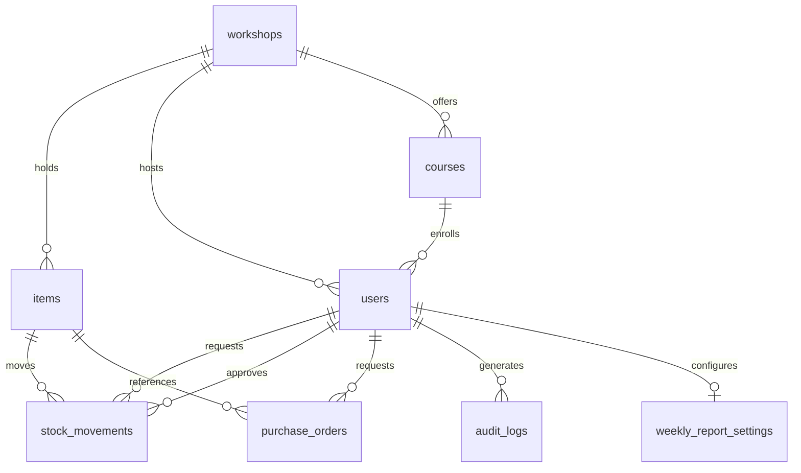

# Database Schema — Inventfy

Details the [Data Model](../REQUIREMENTS.md#7-modelo-de-dados-rascunho) described in the requirements document. This file is the technical reference for columns, types, keys, and indexes; it must be kept in sync with the actual migrations/ORM schema once those exist in code.

**Naming conventions:** tables in snake_case, plural (e.g. `users`, `items`); columns in snake_case, singular. Primary key `id` (bigserial). Every table has `created_at`; tables with editable data also have `updated_at`. `audit_logs` is insert-only (append-only), so it has no `updated_at`.

**Terminology mapping** (REQUIREMENTS.md is in Portuguese; this schema is in English):

| REQUIREMENTS.md (PT) | Schema (EN) |
| --- | --- |
| aluno | student |
| docente / instrutor | teacher / instructor |
| supervisor | supervisor |
| eixo / oficina | workshop |
| curso | course |
| item | item |
| insumo | supply |
| componente reutilizável | reusable component |
| ferramenta/equipamento | tool/equipment |
| condição (novo / em manutenção / danificado) | condition (new / under_maintenance / damaged) |
| movimentação (entrada / saída) | stock movement (inbound / outbound) |
| pedido de compra | purchase order |
| relatório semanal | weekly report |
| log de auditoria | audit log |

### workshops
| Field | Type | Notes |
| --- | --- | --- |
| id | PK (bigserial) | |
| name | string | unique; Electronics, Machining, Fashion* and Information Technology* (*future) |
| created_at | datetime | |
| updated_at | datetime | |

### courses
| Field | Type | Notes |
| --- | --- | --- |
| id | PK (bigserial) | |
| name | string | |
| workshop_id | FK → workshops.id | indexed |
| created_at | datetime | |
| updated_at | datetime | |

### users
| Field | Type | Notes |
| --- | --- | --- |
| id | PK (bigserial) | |
| name | string | |
| registration_number | string | unique |
| email | string | unique; domain validated per RF06 |
| password_hash | string | see password requirements (Section 5) |
| photo | string (optional) | editable by the user themselves (RF06) |
| role | enum | student \| instructor \| supervisor |
| workshop_id | FK → workshops.id | indexed; workshop the user acts in/is enrolled in; for supervisor, defines the workshop under their approval (RN6) |
| course_id | FK → courses.id (nullable) | indexed; students only |
| created_at | datetime | |
| updated_at | datetime | |

### items
| Field | Type | Notes |
| --- | --- | --- |
| id | PK (bigserial) | |
| name | string | |
| proteus_code | string | |
| asset_number | string (nullable) | if applicable |
| category | string | |
| size_model | string | |
| description | string | |
| current_quantity | int | |
| minimum_quantity | int | threshold, editable only by supervisor |
| physical_location | string | |
| photo | string | |
| type | enum | supply \| reusable_component \| tool_equipment |
| condition | enum (nullable) | new \| under_maintenance \| damaged — applies only to tool_equipment and reusable_component (RF01) |
| workshop_id | FK → workshops.id | indexed; each workshop has its own stock (RN5) |
| created_at | datetime | |
| updated_at | datetime | |

### stock_movements
| Field | Type | Notes |
| --- | --- | --- |
| id | PK (bigserial) | |
| item_id | FK → items.id | indexed |
| type | enum | inbound \| outbound |
| quantity | int | |
| requester_id | FK → users.id | indexed |
| approver_id | FK → users.id (nullable) | indexed; null when no approval is required (RN6) |
| purpose | string | |
| status | enum | pending \| approved \| denied \| available \| overdue (RF02) |
| return_deadline | datetime (nullable) | calculated based on shift/profile (RN1, RN2) |
| actual_return_date | datetime (nullable) | |
| created_at | datetime | moment of the request |
| updated_at | datetime | last status change |

### purchase_orders
| Field | Type | Notes |
| --- | --- | --- |
| id | PK (bigserial) | |
| item_id | FK → items.id (nullable) | indexed; null if the item isn't registered yet |
| quantity | int | |
| justification | string | |
| requester_id | FK → users.id | indexed; instructors only (RF07) |
| created_at | datetime | moment of the request |
| updated_at | datetime | |

### weekly_report_settings
| Field | Type | Notes |
| --- | --- | --- |
| id | PK (bigserial) | |
| user_id | FK → users.id | unique, indexed; supervisors only |
| weekday | enum | default: Friday |
| time | time | default: 2:00 PM |
| include_stock_movements | bool | |
| include_workshop_courses | bool | |
| include_workshop_instructors | bool | |
| include_tools_needing_repair | bool | |
| include_items_at_minimum_threshold | bool | |
| include_overdue_borrowers | bool | |
| created_at | datetime | |
| updated_at | datetime | |

### audit_logs
| Field | Type | Notes |
| --- | --- | --- |
| id | PK (bigserial) | |
| user_id | FK → users.id | indexed |
| action | string | |
| affected_entity | string | |
| ip_address | string | |
| created_at | datetime | moment of the event (append-only table, no updated_at) |
